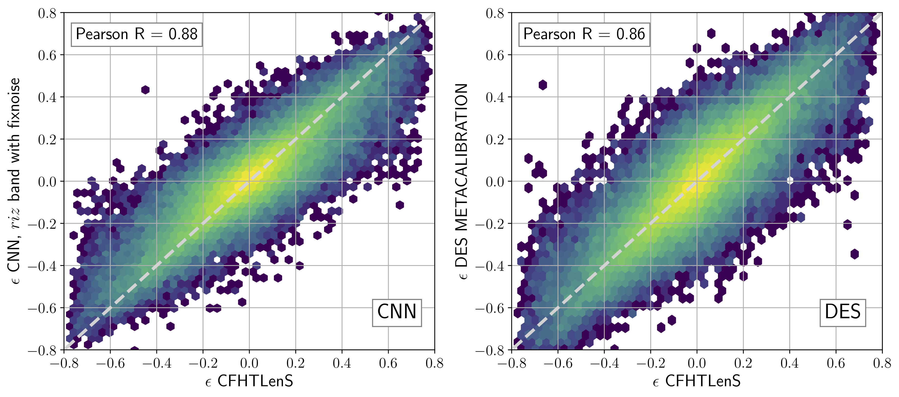
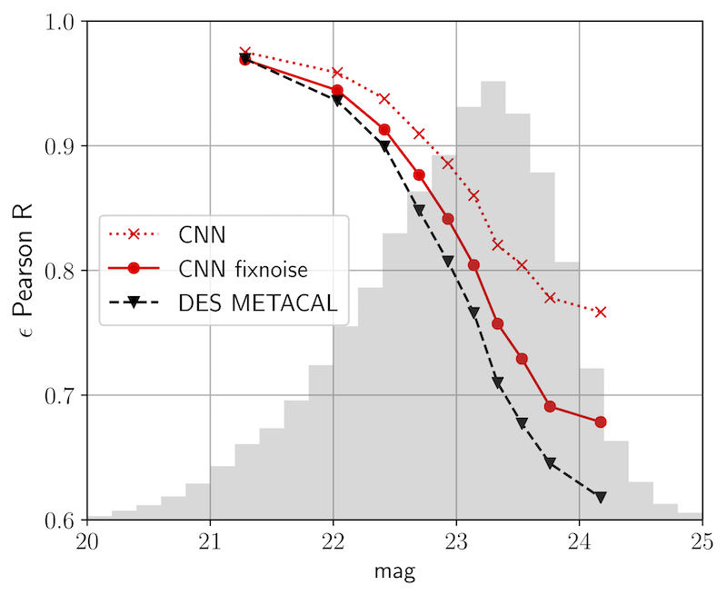
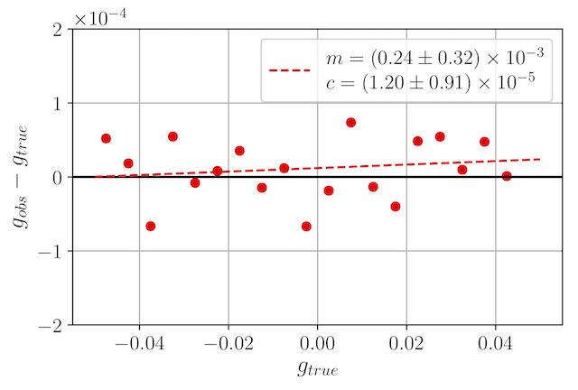
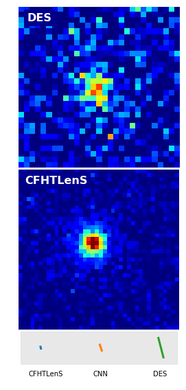
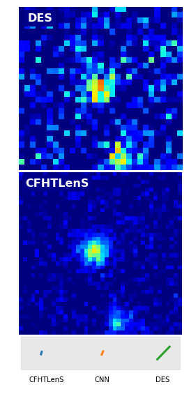
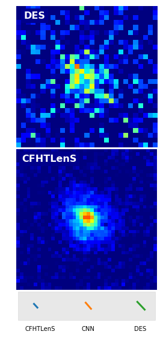

# shearNN

## Galaxy shape measurement with convolutional neural networks

*Dezső Ribli, László Dobos and István Csabai*

*Eötvös Loránd University, Institute of Physics, Budapest, Hungary*

Link: https://arxiv.org/abs/1902.08161

We present our results from training and evaluating a convolutional neural network (CNN) to predict galaxy shapes from wide-field survey images of the first data release of the Dark Energy Survey (DES DR1). We use conventional shape measurements as ground truth from an overlapping, deeper survey with less sky coverage, the Canada-France Hawaii Telescope Lensing Survey (CFHTLenS). We demonstrate that CNN predictions from single band DES images reproduce the results of CFHTLenS at bright magnitudes and show higher correlation with CFHTLenS at fainter magnitudes than maximum likelihood model fitting estimates in the DES Y1 im3shape catalogue. Prediction of shape parameters with a CNN is also extremely fast, it takes only 0.2 milliseconds per galaxy, improving more than 4 orders of magnitudes over forward model fitting. The CNN can also accurately predict shapes when using multiple images of the same galaxy, even in different color bands, with no additional computational overhead. The CNN is again more precise for faint objects, and the advantage of the CNN is more pronounced for blue galaxies than red ones when compared to the DES Y1 metacalibration catalogue, which fits a single Gaussian profile using riz band images. We demonstrate that CNN shape predictions within the metacalibration self-calibrating framework yield shear estimates with negligible multiplicative bias, m<10−3, and no significant PSF leakage. Our proposed setup is applicable to current and next generation weak lensing surveys where higher quality ground truth shapes can be measured in dedicated deep fields.

---

### CNN predict faint galaxies more accurately

---

### Bias-free when implemented in METACALIBRATION

### Example faint galaxies

