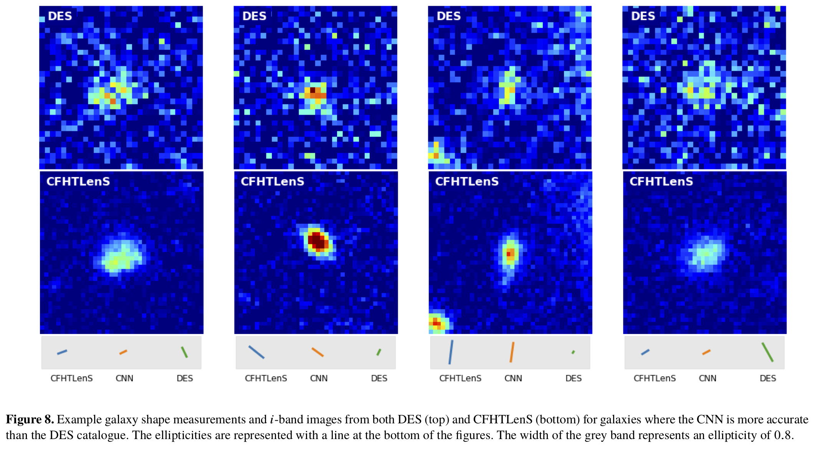
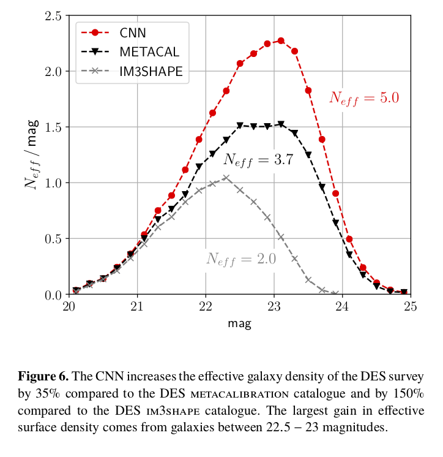

# shearNN

## Galaxy shape measurement with convolutional neural networks

*Dezső Ribli, László Dobos and István Csabai*

*Eötvös Loránd University, Institute of Physics, Budapest, Hungary*

Link: https://arxiv.org/abs/1902.08161

We present our results from training and evaluating a convolutional neural network (CNN) to predict the shapes of galaxies from wide field survey images. As “ground truth”, we use conventional shape measurements from an overlapping superior, deeper survey with less sky coverage. In particular, we predict galaxy shapes from images of the DR1 data release of Dark Energy Survey (DES) using shape measurements from the Canada-France Hawaii Telescope Lensing Survey (CFHTLenS). We demonstrate that CNN predictions from DES images reproduce the results of CFHTLenS at bright magnitudes and show a significantly higher correlation with CFHTLenS at fainter magnitudes than DES results from conventional image analysis. The more accurate shape measurements with the CNN increase the effective galaxy density of DES by 35% compared to the official DES Y1 metacalibration catalogue and by 150% compared to the im3shape catalogue. Prediction of shape parameters with a CNN is also extremely fast, it takes only 0.2 milliseconds per galaxy, improving 4 orders of magnitudes over model fitting. Our proposed setup is applicable to current and next generation weak lensing surveys where higher quality “ground truth” shapes can be measured in dedicated deep fields.

---

### Example faint galaxies

---

### Effective galaxy densities

